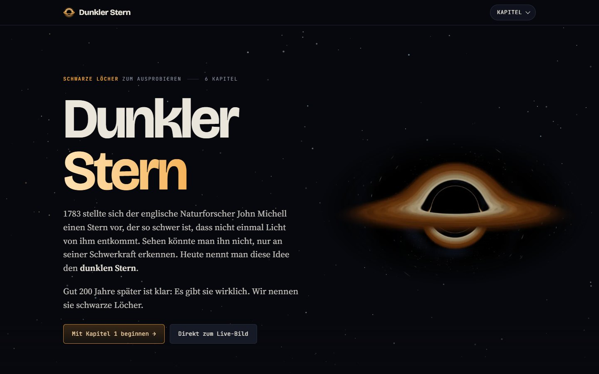

# Dunkler Stern

*Interactive German-language website about black holes, built around simulations you can turn the dials on.*



Eine interaktive Webseite über schwarze Löcher. Statt nur darüber zu lesen, drehen Besucher an Simulationen, bis es Klick macht: sechs Kapitel, die aufeinander aufbauen, jedes mit Instrumenten zum Ausprobieren und Vergleichen aus dem Alltag. Dazu ein Faktencheck zum Film Interstellar.

**Live:** [dunklerstern.de](https://dunklerstern.de)

## Kapitel

| # | Kapitel | Instrumente |
|---|---|---|
| 1 | [Warum Dinge fallen](https://dunklerstern.de/schwerkraft/) | Summe aller Teilchen-Züge, Wanderer auf dem Globus, Zeitfeld mit Kettenfahrzeug |
| 2 | [Vom Stern zum Loch](https://dunklerstern.de/entstehung/) | Lebensphasen eines Sterns, Kernfusion, Zusammenquetschen mit exakten Lichtbahnen |
| 3 | [Gekrümmtes Licht](https://dunklerstern.de/licht/) | WebGL-Raytracer mit Akkretionsscheibe, Schritt-Tour, Seitenansicht der Lichtwege |
| 4 | [Der Fall hinein](https://dunklerstern.de/fall/) | Splitscreen außen und innen, Funksignale, Gezeitenkräfte, drei Lochgrößen |
| 5 | [Wenn Löcher kollidieren](https://dunklerstern.de/kollision/) | Umlauf und Verschmelzung, Wellenform, Gravitationswellen als Ton |
| 6 | [Was niemand weiß](https://dunklerstern.de/offene-fragen/) | Hawking-Rechner, Informationsparadoxon, Singularität, Wurmlöcher, Zeitleiste |
| Extra | [Interstellar im Faktencheck](https://dunklerstern.de/interstellar/) | Millers-Planet-Rechner: Zeitdehnung um ein rotierendes Loch |

## Technik

- Statische Seite aus HTML, CSS und JavaScript. Kein Framework, kein Build-Schritt, keine Abhängigkeiten.
- Keine externen Anfragen, keine Cookies, kein Tracking. Die Schriften liegen auf dem eigenen Server.
- Der Raytracer läuft als WebGL-Fragment-Shader und verfolgt jeden Pixel entlang der echten Lichtbahn um ein nicht rotierendes schwarzes Loch.
- Animationen laufen nur, solange sie sichtbar sind und der Tab im Vordergrund liegt. `prefers-reduced-motion` wird respektiert.
- Strenge Content-Security-Policy und Caching über `site/.htaccess` (Apache).

## Lokal starten

```bash
cd site
python -m http.server 8000
```

Dann [http://localhost:8000](http://localhost:8000) öffnen.

## Aufbau

```
site/
├── index.html                Startseite
├── schwerkraft/ … offene-fragen/, interstellar/   Kapitel und Extra
├── impressum/, datenschutz/, 404.html
├── assets/css/               base.css plus eine Datei je Kapitel
├── assets/js/                common.js plus eine Datei je Kapitel
├── assets/fonts/             selbst gehostete Schriften (SIL OFL)
├── assets/img/               Standbilder aus den Simulationen
└── .htaccess, robots.txt, sitemap.xml
```

## Lizenz

- **Code** (HTML-Struktur, CSS, JavaScript): MIT, siehe [LICENSE](LICENSE)
- **Texte und Bilder**: CC BY-NC 4.0, siehe [LICENSE-CONTENT.md](LICENSE-CONTENT.md)
- **Schriften**: SIL Open Font License 1.1, siehe `site/assets/fonts/`

Rico Herrmann · [mindriclab.de](https://www.mindriclab.de)
